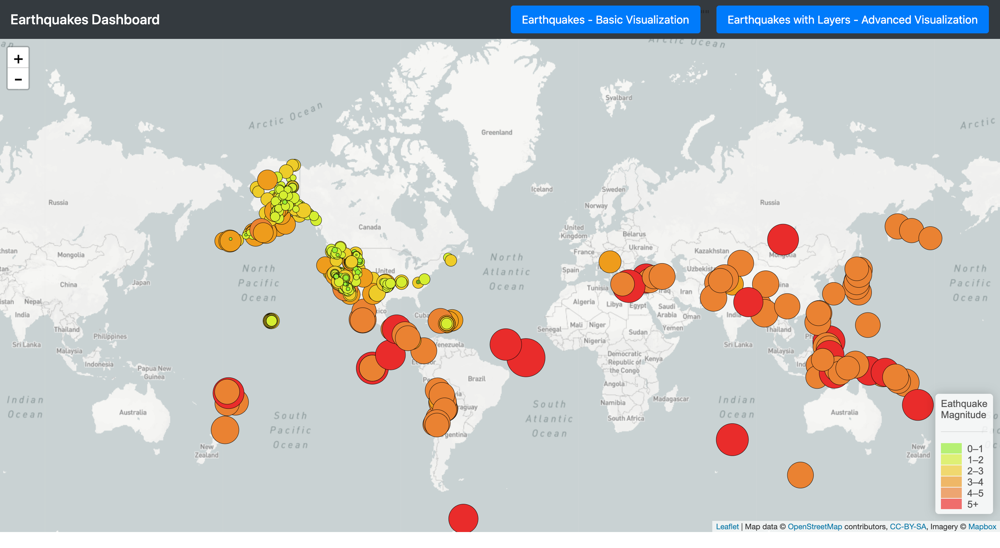

# Leaflet Homework - Visualizing Data with Leaflet

## Background

This respository uses United States Geological Survey, or USGS for short! data wich is responsible for providing scientific data about natural hazards, the health of our ecosystems and environment; and the impacts of climate and land-use change. Their scientists develop new methods and tools to supply timely, relevant, and useful information about the Earth and its processes.

In this project I visualized their earthquake data using html,Javascript, and Leaflet.

## The Task

### Level 1: Earthquakes Basic Visualization

I used [USGS GeoJSON Feed](http://earthquake.usgs.gov/earthquakes/feed/v1.0/geojson.php) to get the data, and I visualized all Earthquakes from the Past 7 Days. 
 
   * The map is created by using Leaflet that plots all of the earthquakes from the data set based on their longitude and latitude. 
   * A data markers also used to reflect the magnitude of the earthquake in their size and color. Earthquakes with higher magnitudes should appear larger the the color spectrum started from green to red, wich means when magnitude increases the color gose from green to red.
     * A popups included to provide additional information about the earthquake when a marker is clicked
     * legend added to provide context of the map data.
 
 The map looks as follows:

### Level 2: Earthquakes Advanced Visualization

In this task I added a second data(layer) set on the map to illustrate the relationship between tectonic plates and seismic activity. Data on tectonic plates can be found at <https://github.com/fraxen/tectonicplates>. 

In this task:
* I ploted a second data set on the map.

* Added a number of base maps to choose from as well as separate out our two different data sets into overlays that can be turned on and off independently.

* Add  a layer controls to the map.

### The Final View Looks as Follows :

### Copyright

Trilogy Education Services © 2019. All Rights Reserved.
